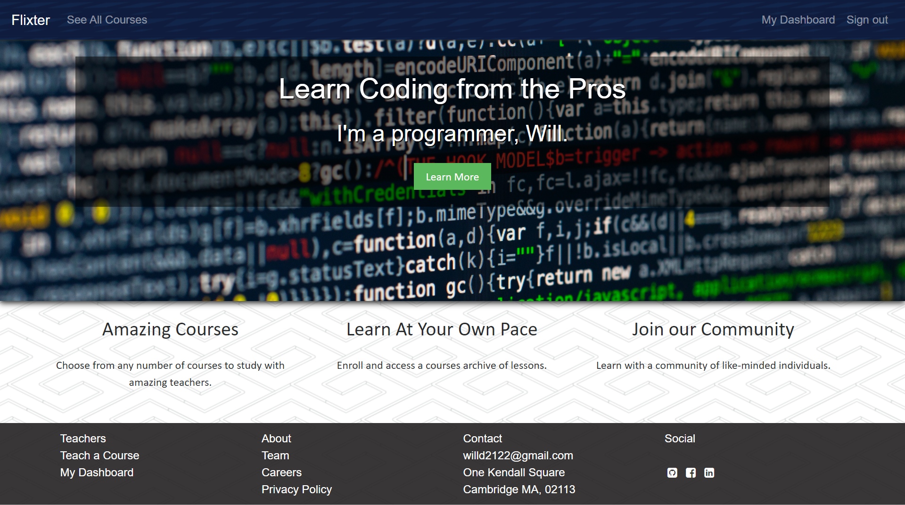
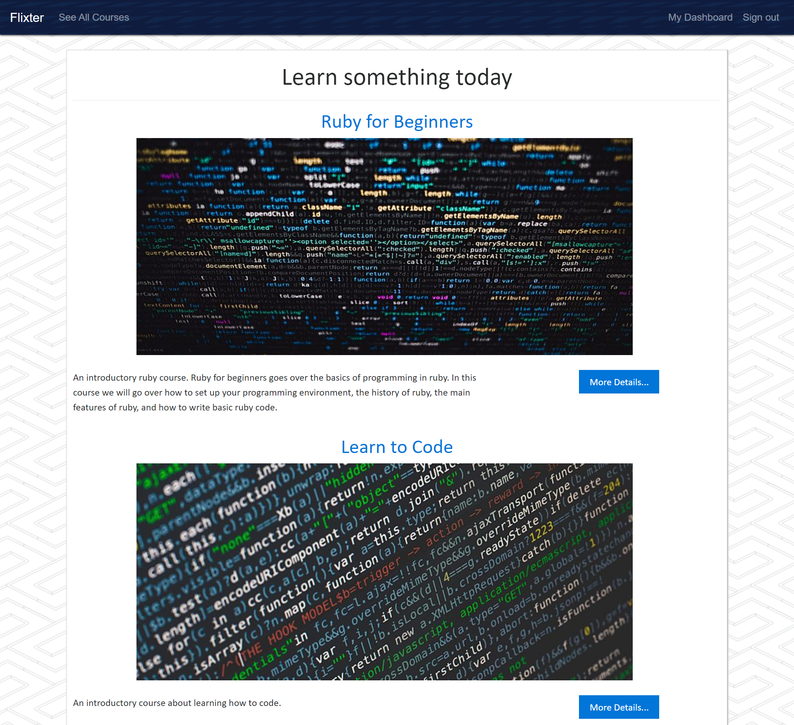
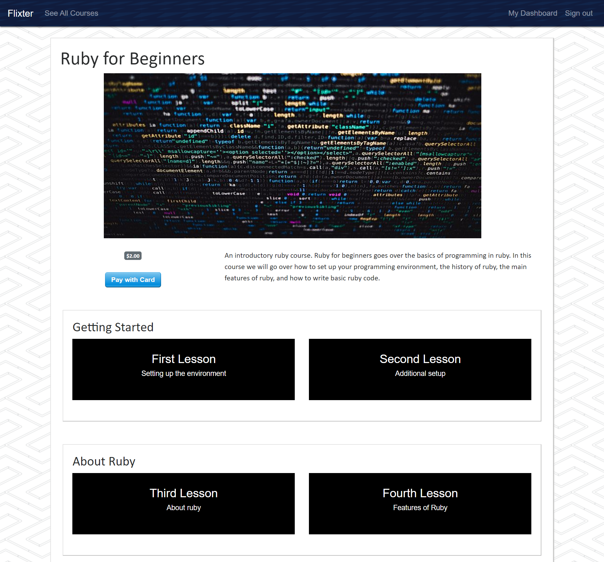

# Nomster

Video streaming platfrom that allows users to create an account and set up a course with different sections and lessons that other users can pay for and sign up to. The app consists of the home page where information and links to different sections of the website is displayed, about pages containing information about the development team, career information, and the privacy policy, a dashboard that allows users to see the courses they are enrolled in as well as the courses they have created, a page that lists out all the courses, and individual course pages that allow users to sign up and access the course. Users can create courses by selecting 'Teach a course' and filling out a form. Once a course is created, other users can see the course on the courses page and click the name of the course to go to the individual course page where they can sign up for, and access the course. Once users have access to a course they can select the course lessons where they are directed to a video lesson they can watch.

## Getting Started

These instructions will get you a copy of the project up and running on your local machine for development and testing purposes.

1. First clone the git repository, copy the url, and run 'git clone paste-url-here' in your coding environment. 

2. From here, you will need to run 'bundle install' and 'rake db:create' to install the necessary gems and create the initial databse respectively. Make sure to also run 'rake db:migrate' to ensure the database is up to date with all the migrations. 

3. Once the database is created, you should be able to get the project up and running on your local machine. Please note however, that some features of this app, such as the payment functionality, will not work in the development environment.

4. In order to deploy your own copy of this project, you will need to add Stripe api keys in order for the payment functionality to work.  

5. Lastly, you will need some way of storing user submitted videos such as Amazon S3.

## Deployed Version of the App:

https://flixter-will-daskam.herokuapp.com/

## Built With

* [Bootstrap](https://getbootstrap.com/) - The web framework used

* Ruby version: 2.5.5

## Author

* **Will Daskam** 
